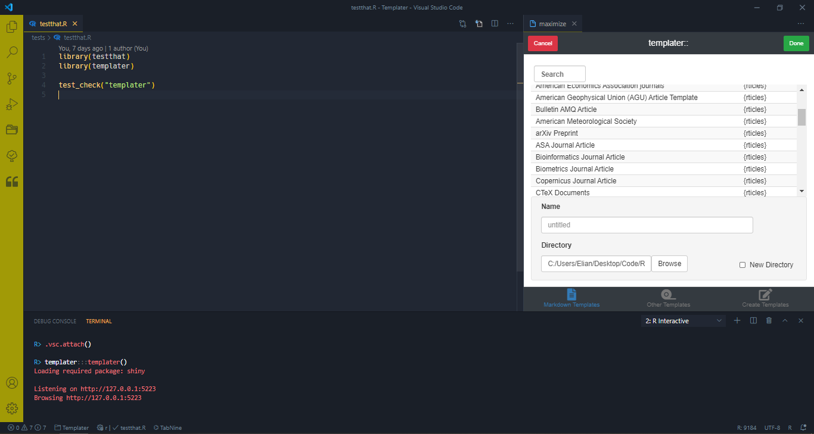
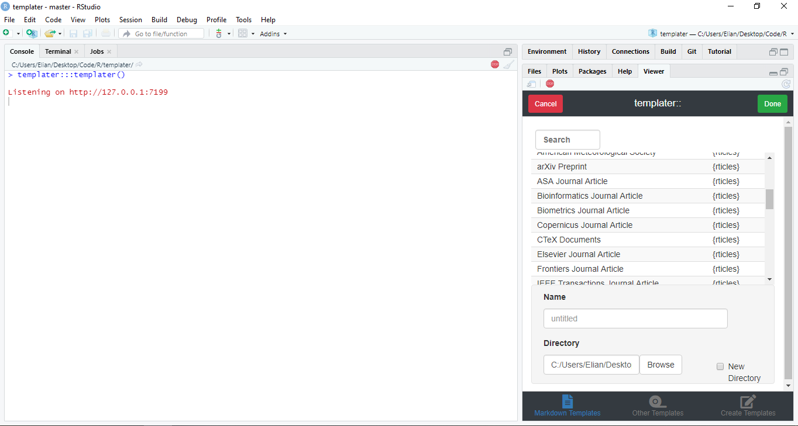

# templater

> Allows for the use of markdown templates from installed R-packages
> (e.g. [papaja](https://github.com/crsh/papaja)), and for the creation
> of user-generated templates.

<!-- badges: start -->

[](https://www.tidyverse.org/lifecycle/#experimental)
[](https://travis-ci.com/ElianHugh/templater)
[](https://github.com/ElianHugh/templater/actions)
[](https://codecov.io/gh/ElianHugh/templater)
<!-- badges: end -->

*{templater}* is an attempt to bring template usage to
[VSCode-R](https://github.com/Ikuyadeu/vscode-R). templater scans your
installed packages for templates that can be used to create rmarkdown
files. templater also comes with some basic templates that can be used
to quickly get started on a project, without having to deal with all the
extra bells and whistles that come with complicated templates. templater
also allows for the creation of basic user-templates.

Future updates will include other (i.e. non-markdown) templates.

# Installation

Install with:

``` r
remotes::install_github("ElianHugh/templater")
```

# Opening Templater

*{templater}* can be called by first loading it into your r session and
then running its shiny gadget

``` r
library(templater)
templater()
```

Alternatively, you can call templater through the addin interface,
meaning you don’t have to make a library call. This will work in
vscode-r as long as you have rstudioapi enabled.

# Template Usage

Markdown templates can be found under the “Markdown Templates” tab,
which lists both package templates and templater templates (including
user-generated templates). You can use the search function to find your
desired template quickly.

Once you have selected a template, input a file name and choose where to
save the file. Clicking done will close templater and open up the new
rmarkdown file.

# Template Creation

You can also use templater to create templates for later use. Navigate
to the “Create Templates” tab, and type in your new template’s name,
description, and body.

The body contains *both* the YAML header and rmarkdown body. When
writing the body, make sure you include the YAML header first. For
example:

``` rmd
---
title: "Untitled"
output: html_document
---

# Header

## Subheader
```

# IDE Differences

templater is unlikely to be useful for those using RStudio, but I hope
that it might find some use amongst vscode users. For extra
functionality (e.g. navigating to new files, IDE dialog, etc.) I am
using the new rstudioapi emulation employed by VSCode-R, so there
shouldn’t be any difference in templater functionality between the two
IDEs. Below you can see templater running in both vscode and RStudio.

#### VSCode-R



#### RStudio


